# Binder Strategy System Visual Diagrams

## Architecture Overview

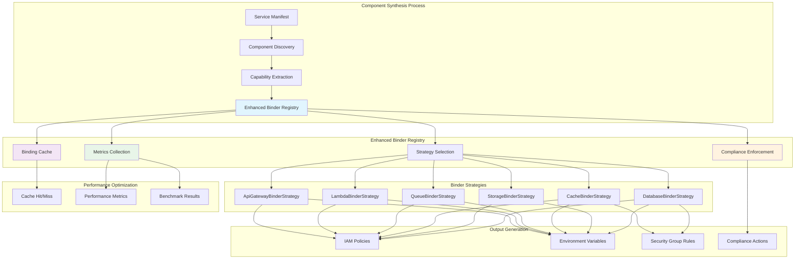

## Binding Flow Diagram

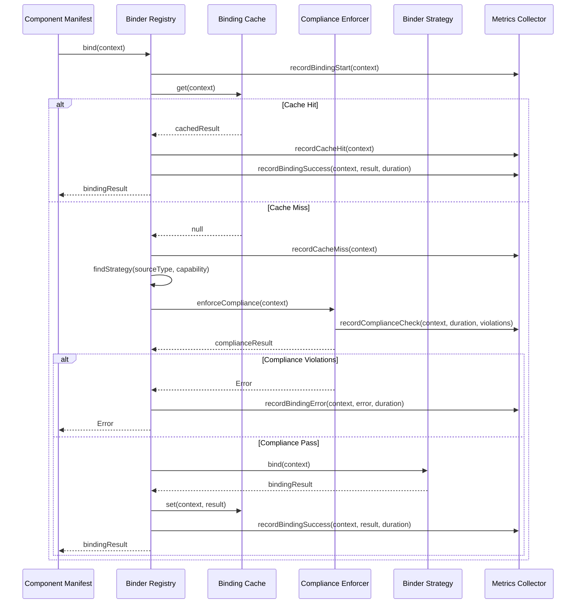

## Capability Matrix

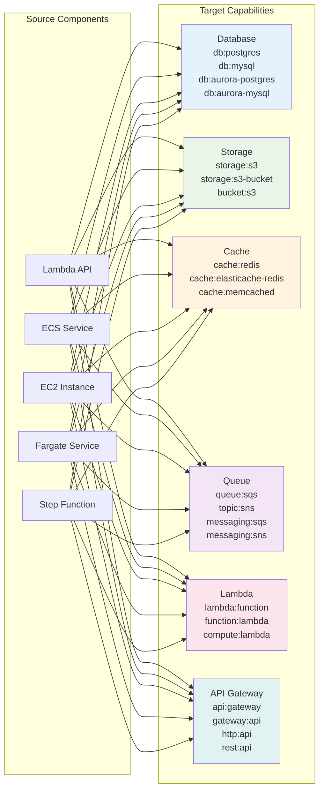

## Compliance Framework Enforcement

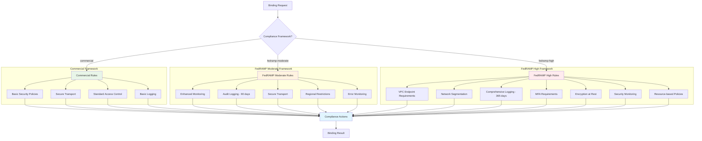

## Database Binding Strategy

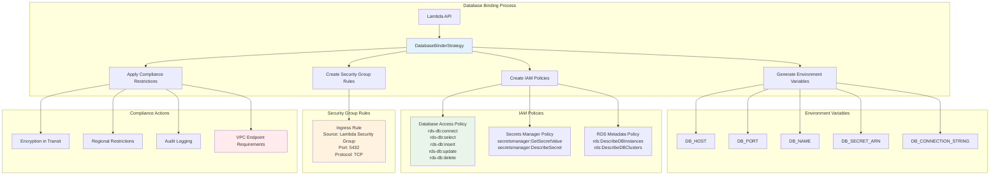

## Storage Binding Strategy

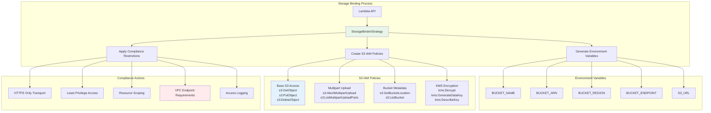

## Cache Binding Strategy

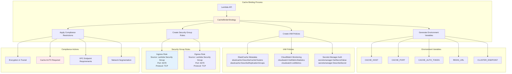

## Queue Binding Strategy

```mermaid
graph TB
    subgraph "Queue Binding Process"
        A[Lambda API] --> B[QueueBinderStrategy]
        B --> C[Generate Environment Variables]
        B --> D[Create SQS/SNS IAM Policies]
        B --> E[Configure Dead Letter Queue]
        B --> F[Apply Compliance Restrictions]
    end

    subgraph "Environment Variables"
        C --> C1[QUEUE_URL]
        C --> C2[QUEUE_ARN]
        C --> C3[QUEUE_REGION]
        C --> C4[DLQ_URL]
        C --> C5[DLQ_ARN]
    end

    subgraph "SQS IAM Policies"
        D --> D1[SQS Access<br/>sqs:ReceiveMessage<br/>sqs:SendMessage<br/>sqs:DeleteMessage]
        D --> D2[SQS Attributes<br/>sqs:GetQueueAttributes<br/>sqs:ListQueues]
        D --> D3[Dead Letter Queue<br/>sqs:SendMessage<br/>sqs:GetQueueAttributes]
    end

    subgraph "SNS IAM Policies"
        D --> D4[SNS Access<br/>sns:Publish<br/>sns:Subscribe<br/>sns:Unsubscribe]
        D --> D5[SNS Attributes<br/>sns:GetTopicAttributes<br/>sns:ListTopics]
    end

    subgraph "Dead Letter Queue"
        E --> E1[Max Receive Count: 3]
        E --> E2[Visibility Timeout: 30s]
        E --> E3[Error Handling Policy]
    end

    subgraph "Compliance Actions"
        F --> F1[HTTPS Only Transport]
        F --> F2[VPC Endpoint Requirements]
        F --> F3[Access Logging]
        F --> F4[Dead Letter Queue Required]
    end

    style B fill:#f3e5f5
    style E1 fill:#e8f5e8
    style F4 fill:#ffebee
```

## Lambda Binding Strategy

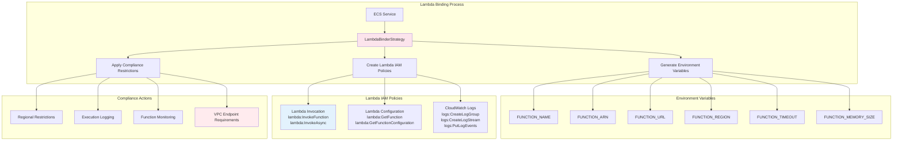

## API Gateway Binding Strategy

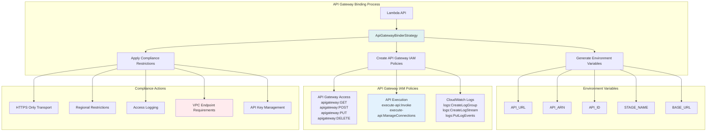

## Performance Optimization

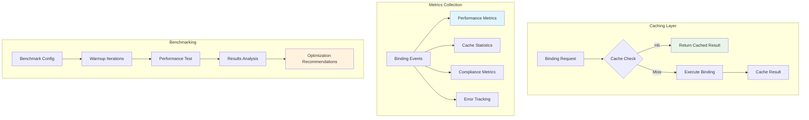

## Error Handling Flow

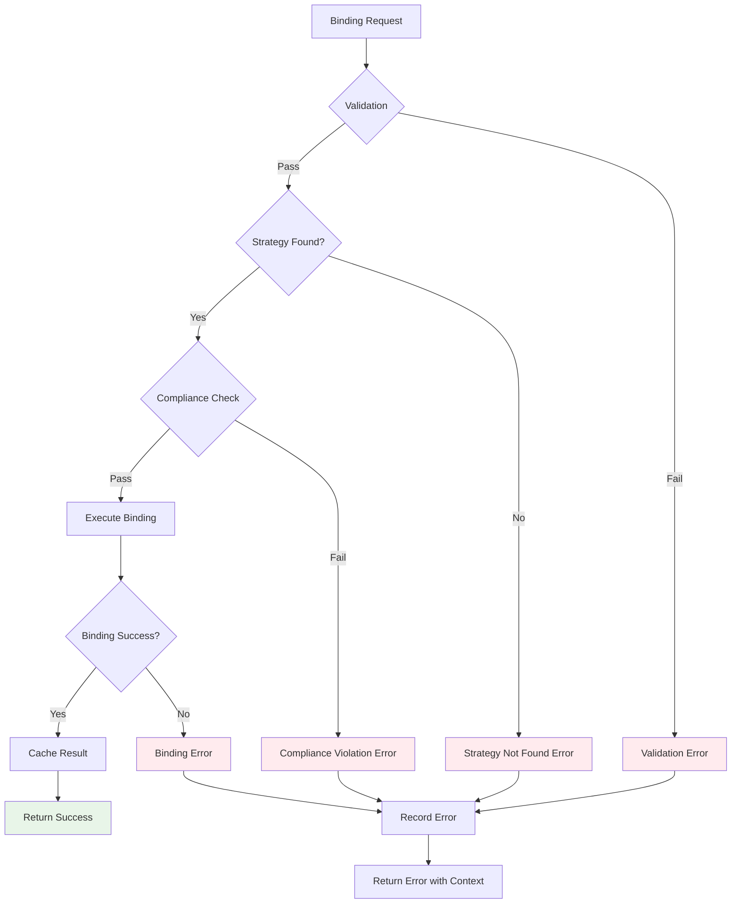

## Integration Points

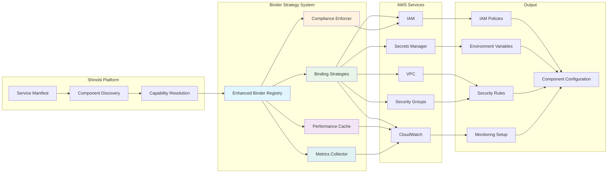
